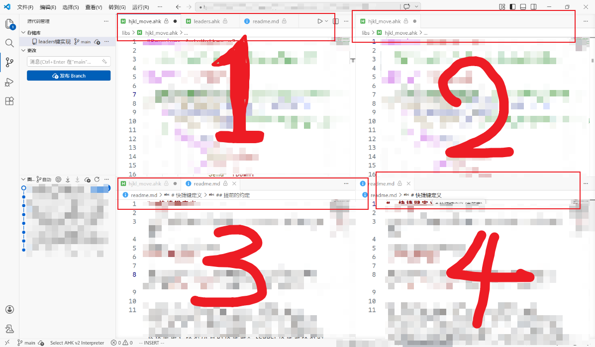
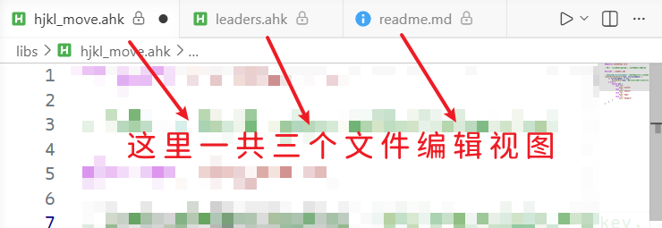
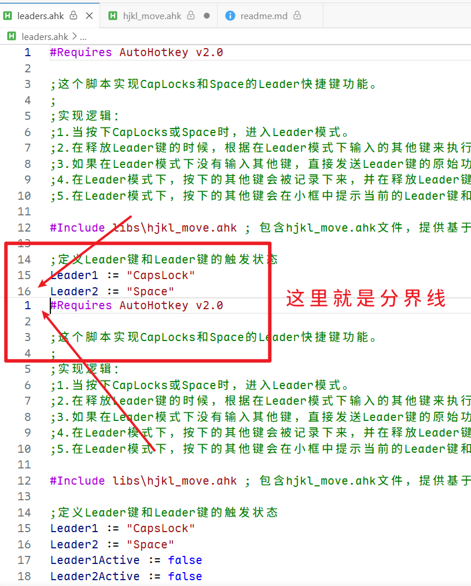

对于文本编辑器的通用操作，这里制定一些通用的快捷键。

这里有一些约定和概念
## 提前的约定

快捷键使用到了Caplock键并取缔了其原有的功能，另外将`Next track`映射到了原来的 caplock。

快捷键的运行需要依赖 Leader 键模式，使用autohotkey脚本，将【空格】【caplock】设置为两个leader键，另外使用【空格】+ Alt 来代替Alt的长快捷键，映射所有的快捷键。leader快捷键映射的是我自行设计的快捷键语言，需要额外在软件中适配，然后才能使用leader快捷键。

caplock 所负责的功能，大致的含义是 外部操作。
alt所负责的功能，大致含义是 内部操作。 
空格所负责的功能，大致含义是 编辑器内部操作。

在软件中设置的必须是 【控制键组合】+ 1个【明文键】，因为很多软件不支持2个明文键，或多个。
## 软件的外部操作

- `caplock-o`打开文件`ctrl-o`
- `caplock-o-d`打开文件夹`ctrl-shift-o`
- `caplock-f-r`设置文件的只读性 `ctrl-shift-r`

## 编辑器内部操作

- `space-f` 搜文件内容`ctrl-f`
- `space-f-d`搜索目录内容 `ctrl-shift-f`
- `space-s` 保存文件  `ctrl-s`
- `space-a` 选中所有内容  `ctrl-a`
## 软件的内部操作

alt 如果表示不了的，使用 space-alt 表示。

- `alt-a`打开设置 
	- 这么设置的理由是，alt是菜单展开的控制键，a是首要的字母，那么设置就是alt-a。
- `alt-c`打开命令面板  
	- 理由是alt是菜单的控制键，c是CLI的头字母。
- `space-alt-k-s` 打开快捷键  `ctrl-alt-k`
	- alt是菜单控制，k是键盘，s是快捷的意思。
- `alt-x` 打开插件面板 
	- x就是插件 
- `alt-d` 打开工作区目录 
	- d 就是目录 
- `alt-r` 打开运行测试
	- r就是run 
### vscode的视图机制

 vscode 内部的编辑器视窗，看起来是一个有多个标签的视窗。 其实那只是其中一个，他可以有多个。
#### 编辑器主视窗
主视窗就是vscode自身一个windows窗口只能提供一个主视窗。
主视窗内部装载的是组视窗，可以有多个组视窗。

#### 组视窗

组视窗就是几个文件标签所代表的各自文件的编辑视图所共享展示的视窗。

#### 文件编辑视图

文件编辑视图是每个文件独占的，而不是共享的，组视窗是多个文件编辑视图共享的。文件编辑视图还可以分成多个**内容视角**。
![[|370]]

---

- `alt-l-1` 组视窗有 1列 space-alt-ctrl-1
- `alt-l-2` 组视窗有 2列 space-alt-ctrl-2。
- `alt-l-1` 组视窗有 1行  
- `alt-h-2` 组视窗有 2行 space-alt-shift-2
- `alt-w-g` 组视窗呈网格 4窗, space-alt-ctrl+g
- `alt-u-x` 组视窗向下生，并复制当前的文件编辑视图(双拼字符首字) space alt ctrl x
- `alt-u-y` 组视窗向右生，并复制当前的文件编辑视图 space alt ctrl y
- `alt-u-z` space alt ctrl z
- `alt-u` space alt ctrl u
- `alt-u-j` uj是视角的意思，内容视角生 同样也是回收视角。space alt ctrl j
- 
